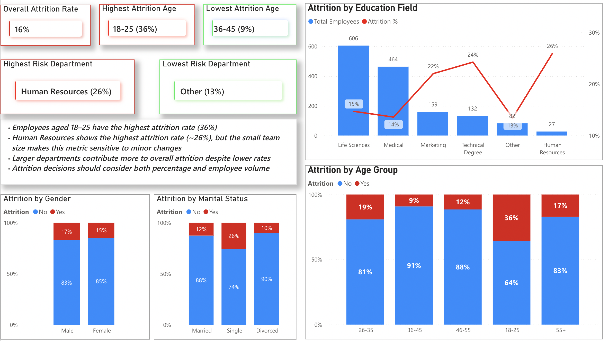
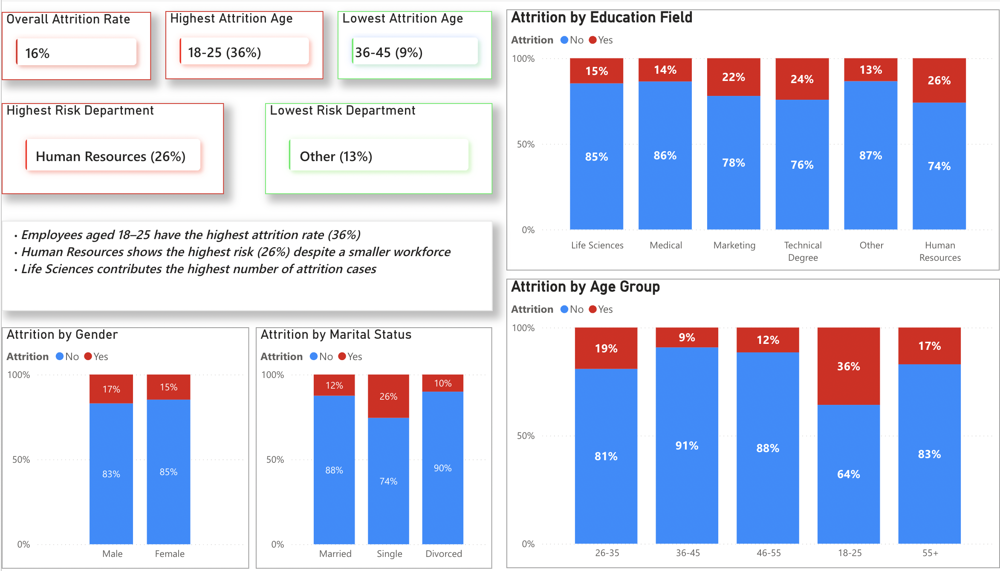

📊 Employee Attrition Dashboard (Power BI)
🔍 Overview

This project analyzes employee attrition and identifies key drivers behind employee turnover using Power BI.

🎯 Key Insights
1. Demographics

Employees in their early twenties have higher Attrtiion rate.

2. Working Factors
Attrition is highest in the first 2 years of employment.

4. Compensation
   
5. Employee Lifecycle Risk

🛠 Tools Used
Power BI
DAX
Data Visualization

💡 Objective
To uncover actionable insights that help organizations reduce employee attrition and improve retention strategies.
