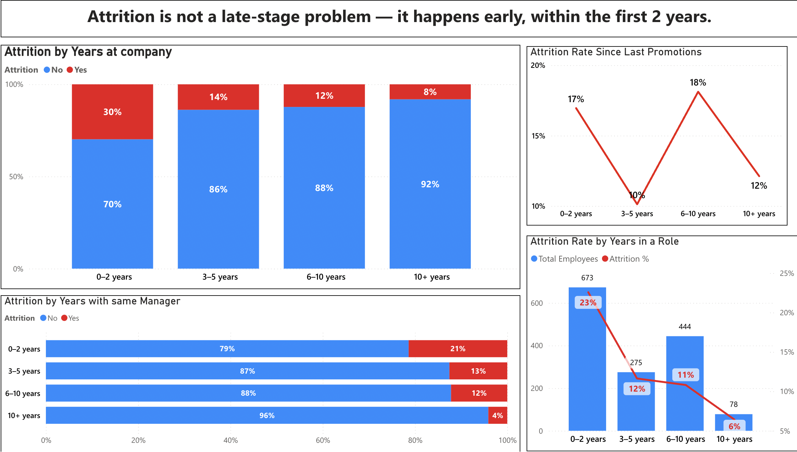
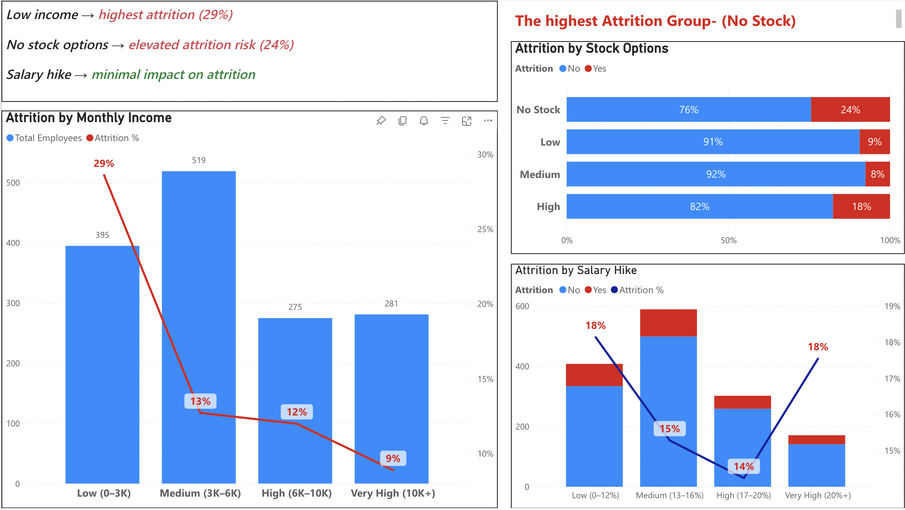

#  📊 Employee Attrition Dashboard (Power BI)
## 🔍 Overview
This project analyzes employee attrition and identifies key drivers behind employee turnover using Power BI.

# 🎯 Key Insights
## 1. Demographics
    Employees in their early twenties have higher Attrtiion rate.

## 2. Company Factors
    Attrition is highest in the first 2 years of employment.

## 4. Compensation
    Employees in lowest income range and with no stocks shows the highest Attrition rate. 

  
## 5. Working Factors
    Poor working factors contribute to higher Attrition Rate

    
## 🛠 Tools Used
1. Power BI
2. DAX
3. Data Visualization

## 💡 Objective
To uncover actionable insights that help organizations reduce employee attrition and improve retention strategies.
